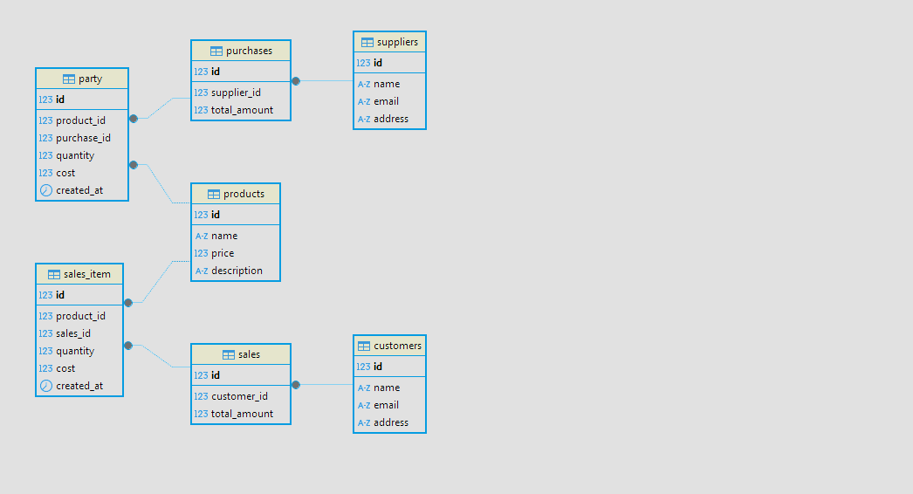
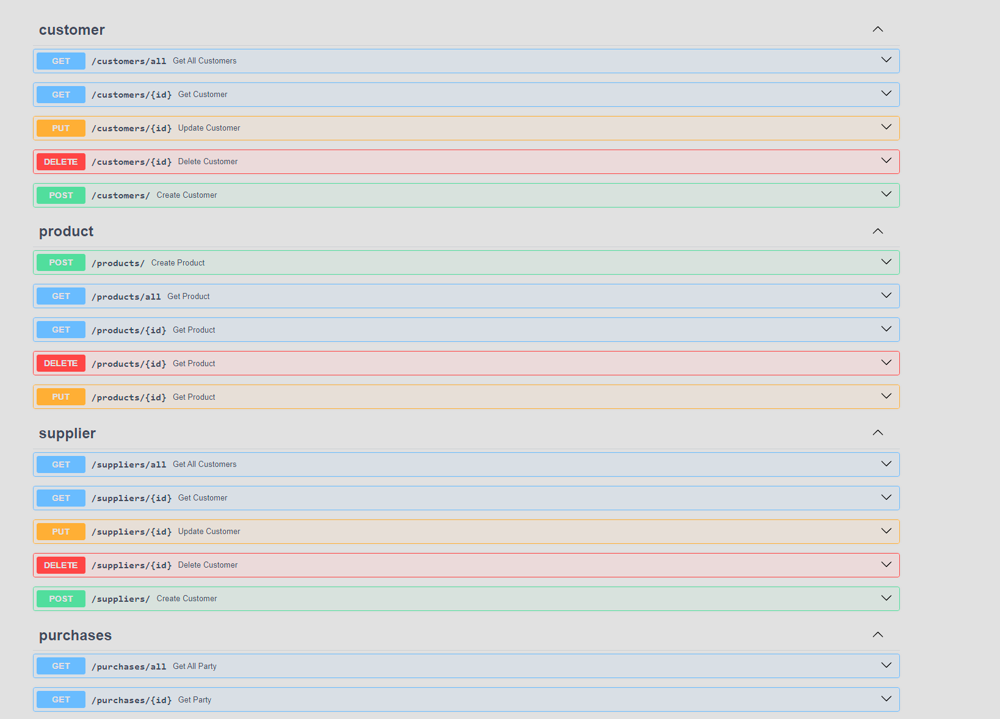

# Луковая архитектура и использование патерна unit to work
Проект представлет из себя закупку продаж товаров.

Товари продаються по FIFO first in first on.

6 сущностей в проекте вот между ними связь



### У каждой сущности есть свой **api** на **crud** операции

### Для запуска пректа скопируйте его себе с помощью команды `git clone` перейди в папку и выполните следущие команды 


``` bash 
poetry install 
alembic upgrade heads
uvicorn --factory app.configurations.app:create_app --port 8000 
```
